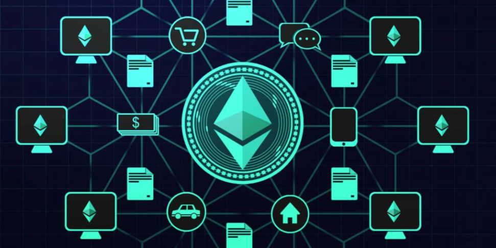

# Community Connect

A decentralized application to facilitate an ecosystem of donors, non-profits, and end users in the distribution of aid. Community Connect allows Donors and Philanthropists to Donate money with the Trust that All the Money goes to Charitable works. We have Automated the process of receiving donations, reguests in the form of cash assistance, reguests for Goods and also Rides and then fullfillment of the Requests in a trustless way that Smart Contracts are optimal for. Donors and users of the dapp are able to verify all activity on the blockchain.

## Technologies

Streamlit

## Requirements
Create a `.env` file
* Specify the address that the Web3 provider will use for the local `Ganache` blockchain.
`WEB3_PROVIDER_URI=HTTP://127.0.0.1:7545`

* Specify the address of the deployed contract.  You can find this address in the Remix IDE when displaying the deployed contract.  See example below.
`SMART_CONTRACT_ADDRESS='<YOUR_DEPLOYED_CONTRACT_ADDRESS_HERE>'`

## Installation Guide

## Usage

## Contributors

Additional updates/ uploads for usability was added by [Dave Thomas](mailto:sjufan84@gmail.com)

Additional updates/ uploads for usability was added by [Stephen Thomas](mailto:stephenthomas43@gmail.com)

Additional updates/ uploads for usability was added by [Christina San Diego](mailto:cbuted@gmail.com)

Additional updates/ uploads for usability was added by [Dylan Nelson](mailto:)

## License

MIT License